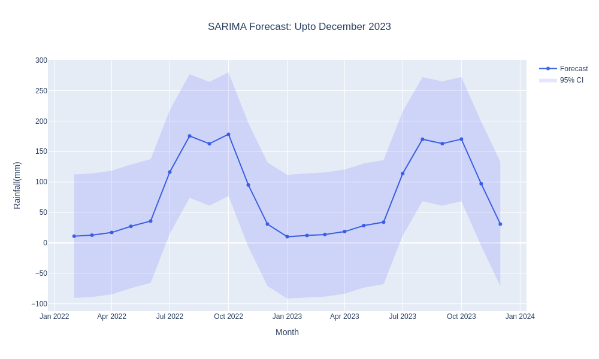
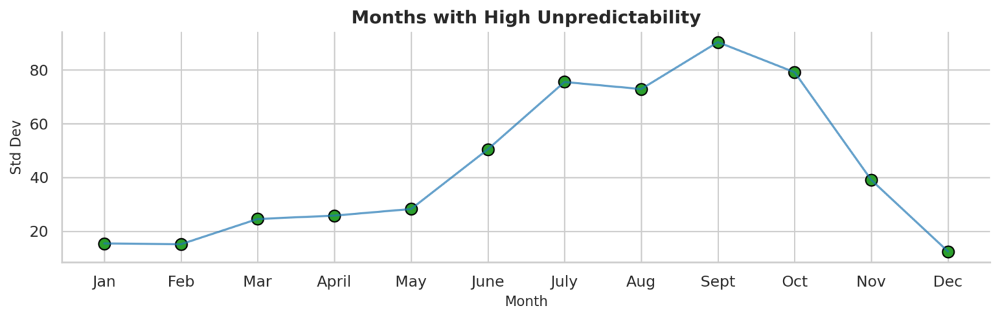
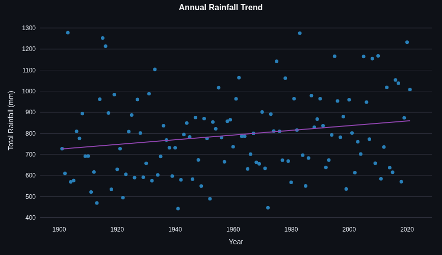
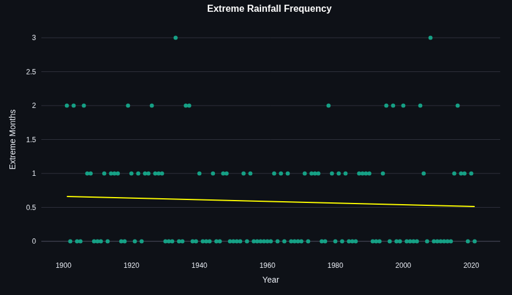
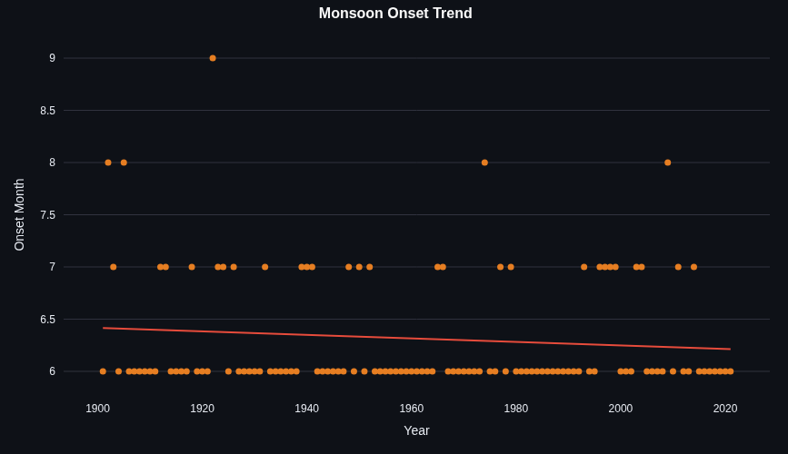

# Hyderabad Rainfall Forecasting

> How I Built an AI-Powered Rainfall Predictor for “Hyderabad” using Python and LangChain?
> 

### 1. Introduction

Hi, I'm Moin Khan, a passionate engineer who loves to extract valuable insights from data. In this blog, I'll walk you through my recent data science project focused on rainfall prediction.

- Project Overview
    - Analyzed Hyderabad's historical rainfall dataset containing monthly and average rainfall measurements from 1901-2021
    - Calculated yearly anomalies to identify below-normal or above-normal rainfall patterns
    - Implemented a SARIMA (Seasonal Auto-Regressive Integrated Moving Average) statistical model to forecast monthly rainfall for user-specified years (e.g., 2023, 2025, 2026)
    - Developed a RAG (Retrieval-Augmented Generation) pipeline using LangChain, Cohere, and FAISS
    - Created an interactive query system allowing users to learn about analysis terminology for better understanding of visualization results
    - Generated customizable rainfall visualizations with half-decade, decade, or two-decade intervals based on user preference
    - Packaged all functionalities into a Streamlit application for enhanced user experience and control
    
    ### 2. Tools and Libraries
    
     a) Libraries
    
    - Pandas - For data processing and ETL operations
    - NumPy - For mathematical calculations
    - LangChain - For LLM integration
    - Statsmodels - For implementing SARIMA time series modeling
    - Streamlit - For building the user interface
    - Plotly, Matplotlib - For data visualization
    - FAISS-CPU - For vector database implementation in RAG
    
     b) Tools
    
    - VS Code
    - Jupyter Notebook
    - Cohere API
    - UV for Python
    
    ### 3. Dataset Description
    
    Source: [Government of India](http://imd.gov.in) 
    
    - View Data Table
        
        [hyd-monthly-rains](https://www.notion.so/22eb8f08385081ef88bff385b7f49cae?pvs=21)
        
    
    DataSet Date Range: 1980/01/01 - 2021/12/31
    
    Format: CSV
    
    ### 4. Understanding Basic Terminologies
    
    - TIME SERIES ANALYSIS : Time series analysis is a specific way of [analyzing](https://tableau.com/analytics) a sequence of data points collected over an interval of time. In time series analysis, analysts record data points at consistent intervals over a set period of time rather than just recording the data points intermittently or randomly. However, this type of analysis is not merely the act of collecting data over time.
    - ARIMA and SARIMA: ARIMA and SARIMA are both [algorithms for forecasting](https://towardsdatascience.com/forecasting-with-machine-learning-models-95a6b6579090). **ARIMA** takes into account the past values (autoregressive, moving average) and predicts future values based on that. **SARIMA** similarly uses past values but also takes into account any seasonality patterns. Since SARIMA brings in seasonality as a parameter, it’s significantly more powerful than ARIMA in forecasting complex data spaces containing cycles.
    - AnamolyIn data science, an anomaly (also called an outlier or novelty) is **a data point that significantly deviates from the expected pattern or distribution within a dataset**. Essentially, it's something that doesn't quite fit in with the rest of the data and can indicate errors, rare events, or potential issues that need further investigation.
    - OLS Trendline: **Ordinary Least Squares regression** (**OLS**) is a common technique for estimating coefficients of [linear regression](https://www.xlstat.com/en/products-solutions/feature/linear-regression.html) equations which describe the relationship between one or more independent quantitative variables and a dependent variable (simple or multiple linear regression), often evaluated using r-squared.
    
    ### 5. Try it 🫶🏼
    
    [https://forecasting-by-moin.streamlit.app/?embed=true](https://forecasting-by-moin.streamlit.app/)
    
    **Key features:**
    
    - Get rainfall predictions for any year you choose
    - Confused by technical terms? Ask our integrated AI model anytime
    - Access extra visuals without creating them manually
    - Discover the wettest and driest rainfall periods based on your selected interval
    

### 6. Code snippets

- SARIMA Model
    
    ```python
    from statsmodels.tsa.statespace.sarimax import SARIMAX
    
    def sarima_forecast(df, monthly_cols, user_year):
    
     df=df.reset_index(drop=True)
    
     ts_rainfall = df.set_index('Year')[monthly_cols].stack()
     ts_rainfall.index = pd.date_range(start='1901-01-01', periods=len(ts_rainfall), freq='ME') #ME stands for Monthly Intervals
    
     last_date = ts_rainfall.index[-1]
     last_year = last_date.year
    
     forecast_months=((user_year- last_year)) *12
     # so if user enters: 2025 it calculates 
     # 2025 - 2021 (which is last year) gives us 4
     # By multipying it with 4 we got Months in 4 years e.g. 48
    
     if forecast_months  <=0:
       raise ValueError("Target Year must be after last data year e.g. 2021!!")
    
     order = (1, 1, 1)
     seasonal_order = (1, 1, 1, 12)
    
     model = SARIMAX(ts_rainfall, order=order, seasonal_order=seasonal_order)
     model_fit = model.fit()
     
    '''
    The above is just a code snippet and not the functional code. This is for informational purposes, like how I fit the model. Please correct this line.
    '''
    ```
    
    
    
- Langchain+Cohere
    
    ```python
    embeddings = CohereEmbeddings(
        cohere_api_key=cohere_key, #your cohere api key
        user_agent="rainfall-app/1.0"
    )
    
    docs = [
        Document(page_content=item["text"], metadata={"term": item["term"]})
        for item in documents
    ]
    
    # Creatng a Verctor DB
    db = FAISS.from_documents(docs, embeddings)
    
    terms = [item["term"] for item in documents]
    
    llm = ChatCohere(
        model="command-r-plus",
        cohere_api_key=cohere_key
    )
    
    template = """
    
    Your Template, just write anything like how you write to GPT
    
    """
    
    prompt = PromptTemplate.from_template(template)
    
    chain = prompt | llm #cohere invoking function
    
    __all__ = ["docs","db", "terms", "chain"] 
    #exporting this all to streamlit app.py
    
    ```
    

### 7: Requirement.txt

- streamlit
- pandas
- scikit-learn
- langchain
- cohere
- python-dotenv
- statsmodels
- plotly
- matplotlib
- seaborn
- faiss-cpu==1.7.4

### 8. Understanding the Predictions



**What does it show?**

This line graph displays monthly rainfall variability measured by standard deviation. Higher values indicate greater unpredictability in rainfall patterns.

**Key takeaway:**

- From **June to October**, unpredictability is very high, peaking in **September**.
- The rest of the year remains relatively stable and predictable.

**In simple words:**

During the June-October period, rainfall patterns are highly variable — some years bringing excessive precipitation while others experience drought conditions.



**What does it show?**

This scatter plot displays the annual rainfall totals, measured in millimeters (mm).

- Each dot represents one year's total rainfall.
- The purple line indicates the overall trend.

**Key takeaway:**

- Annual rainfall varies significantly year to year.
- The upward trend line suggests rainfall is gradually increasing over time.

**In simple words:**

Despite yearly fluctuations in rainfall, we're experiencing slightly more precipitation now than we did a few decades ago.



**What does it show?**

This scatter plot displays the frequency of extreme rainfall months each year.

- Each dot shows how many extreme rainfall months occurred in a given year.
- The yellow line indicates the overall trend over time.

**Key takeaway:**

- Extreme rainfall months occur periodically.
- The trend line slopes slightly downward, suggesting no increase in frequency.

**In simple words:**

Months with very heavy rainfall do occur occasionally, but their frequency hasn't increased over the years.



**What does it show?**

This scatter plot displays when the monsoon starts each year, measured by month.

- Each dot represents when the monsoon began that year.
- The red line indicates the overall trend.

**Key takeaway:**

- The monsoon typically begins around month 6 (June).
- The downward trend line suggests that the monsoon may be arriving slightly earlier now than in the past.

**In simple words:**

The monsoon season generally starts in June, but data indicates it might be arriving a bit earlier in recent years.


**What does it show?**

This bar chart displays the yearly deviations from average rainfall, showing how each year compares to the long-term normal.

- **Green bars** = Above-normal rainfall (wetter than average)
- **Red bars** = Below-normal rainfall (drier than average)

**Key takeaway:**

- Some years received significantly more rainfall than expected
- Other years experienced much less rainfall than normal
- This fluctuating pattern has consistently occurred for over a century

**In simple words:**

Rainfall varies considerably year to year — with some years being notably wetter and others drier than the typical average.

### 9. Conclusion

This project's analysis reveals that rainfall patterns in Hyderabad are naturally variable with subtle shifts occurring over time. Key findings include:

- Monsoon months show significantly higher unpredictability than other times of the year
- Annual rainfall regularly fluctuates above or below the long-term average, creating distinct anomalies
- Extreme rainfall events continue to occur occasionally, without showing a sharp increase in frequency
- The monsoon season appears to be starting slightly earlier than in previous decades
- Total annual rainfall shows a gradual upward trend

Simply put, while rainfall patterns remain irregular, these subtle changes could significantly impact agriculture, water management, and urban planning in the coming decades. Understanding these patterns helps us prepare for both short-term unpredictability and long-term climate shifts.

### 10. What I Have Learned

- Learned how to use RAG and build a RAG pipeline, and understood its importance in preventing LLM hallucinations
- Learned about Streamlit's session_state function and how it enables building user-friendly applications
- Refreshed my core Pandas skills and data visualization techniques
- Gained experience with Plotly Express for creating interactive visualizations

> So yeah, that’s all! A heartfelt thanks to the developers of Streamlit for making interactive web apps so easy, to Cohere for providing a free-to-use AI model, and of course to the developers of ChatGPT — you buds helped me a lot with debugging!
> 

- Feel Free to Reach me out:
    - [LinkedIn](https://www.linkedin.com/in/moin-khan-0335b4245)
    - [Email](mailto:kmoin9985@gmail.com)
